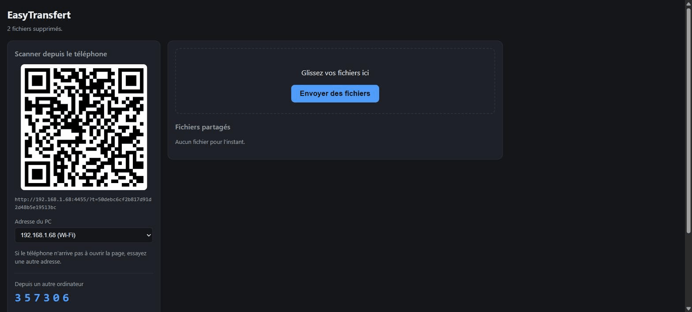
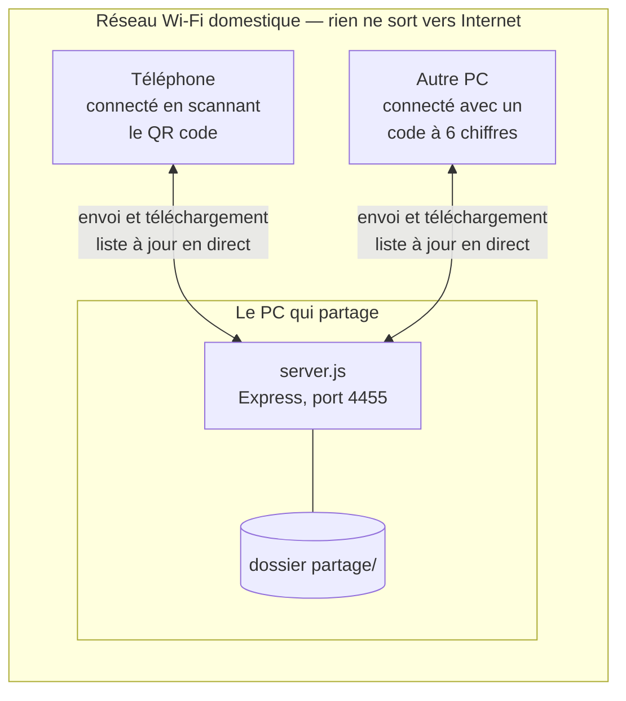

# EasyTransfert

**🇬🇧 [English version](README.md)**

[](https://github.com/kaogn/EasyTransfert/actions/workflows/ci.yml)

Transférer des fichiers entre un PC Windows et un téléphone, sur le Wi-Fi de la maison, en
scannant un QR code. Rien à installer sur le téléphone : un navigateur suffit.



*Les fichiers envoyés depuis le téléphone apparaissent sur le PC sans rechargement.*

## En un coup d'œil



Un seul appareil lance le programme. Les autres ouvrent une page web : le téléphone en
scannant le QR code, un second ordinateur en saisissant un code à six chiffres.

---

## ⚠️ À lire avant de s'en servir

**EasyTransfert ne chiffre rien. Il est conçu pour un réseau domestique privé, et pour
rien d'autre.**

Concrètement, sans enrobage :

- **Tout circule en HTTP simple.** Pas de HTTPS, pas de TLS, pas de certificat. Chaque
  fichier envoyé traverse le réseau en clair.
- **Le jeton d'accès est dans l'URL** — dans le QR code, et dans les liens de
  téléchargement. Quiconque peut observer le trafic réseau est en mesure de le lire.
- **Qui détient ce jeton est maître du dossier partagé.** Il peut lister, télécharger,
  déposer et *supprimer tous les fichiers*, depuis n'importe quel appareil du réseau.
- **Il n'y a ni compte, ni permissions, ni journal.** Le jeton est l'unique barrière.
- **Le jeton survit aux redémarrages**, pour que le téléphone puisse garder la page en
  favori au lieu de rescanner à chaque fois. Un jeton qui fuite reste donc valable jusqu'à
  ce que vous cliquiez sur **« Générer un nouveau jeton »** sur le PC, ce qui déconnecte
  aussitôt tous les appareils.
- **Un code à six chiffres permet d'obtenir le jeton** sans authentification préalable :
  c'est le mécanisme d'appairage d'un nouvel appareil. Il est protégé par une limitation
  stricte du débit — cinq essais, puis trente secondes de blocage qui s'appliquent même au
  bon code, et rotation du code à chaque rafale. Sur un réseau maîtrisé, forcer un million
  de combinaisons à ce rythme prendrait des années. Sur un réseau hostile, cela reste un
  point d'entrée à considérer.
- **Un onglet resté ouvert continue d'appeler l'adresse et le port d'origine**, jeton
  compris. Si un autre programme prend ce port entre-temps, il recevra ces appels. Le
  serveur, lui, vérifie l'identité de l'instance en place avant de lui confier quoi que ce
  soit — mais le navigateur, en HTTP simple, n'a aucun moyen de le faire.

**Ne lancez pas ce programme sur un Wi-Fi que vous ne maîtrisez pas** — résidence
étudiante, bureau, café, hôtel, espace de coworking, ou toute connexion partagée. Sur un
tel réseau, considérez que tout ce que vous déposez dans le dossier partagé est public.

La règle de pare-feu créée est volontairement limitée au profil réseau **privé** : sur un
réseau déclaré « public » dans Windows, les connexions entrantes restent bloquées. C'est
un garde-fou, pas une garantie de sécurité.

Pour transférer des fichiers sur un réseau non maîtrisé, utilisez un outil qui chiffre de
bout en bout — [LocalSend](https://localsend.org) fait très bien le travail.

---

## Ce qu'il fait

- Une page web unique, commune au PC et au téléphone, en français.
- Les fichiers atterrissent dans un dossier `partage/`, à côté du programme.
- Un envoi apparaît **en direct sur l'autre appareil**, sans rechargement (SSE).
- Glisser-déposer depuis le PC, sélecteur de fichiers depuis le téléphone, barre de
  progression.
- Suppression d'un fichier, ou de tous d'un coup.
- **Le lien reste valable d'un démarrage à l'autre** : on appaire le téléphone une fois, on
  ajoute la page à son écran d'accueil, et on ne scanne plus jamais. Un bouton sur le PC
  délivre un nouveau jeton en cas de besoin.
- **Marche aussi d'un PC à l'autre** : un seul ordinateur lance le programme, l'autre ouvre
  l'adresse et saisit le code à six chiffres affiché en face. Pas de QR code à scanner
  quand on n'a pas de caméra, pas de jeton de 32 caractères à recopier.
- Les noms accentués survivent à l'aller-retour.
- **Aucune requête sortante.** Pas de CDN, pas de police distante, pas de service tiers,
  pas de télémétrie. Rien ne sort du réseau local.

## L'utiliser sans rien installer

Récupérez le `.zip` depuis la page [Releases](../../releases) et décompressez-le. Il
embarque sa propre copie de Node.js : rien d'autre n'a besoin d'être installé.

> Avant de décompresser : clic droit sur le `.zip` → Propriétés → cocher **Débloquer**.
> Cela évite un avertissement SmartScreen sur chaque fichier extrait.

Chaque publication contient aussi un `SHA256SUMS.txt`. Pour vérifier que l'archive
téléchargée est intacte, dans PowerShell :

```powershell
Get-FileHash EasyTransfert.zip -Algorithm SHA256
```

L'empreinte affichée doit correspondre à celle du fichier. Cela détecte un téléchargement
corrompu ou altéré en chemin ; ce n'est pas une signature, puisque l'empreinte est publiée
au même endroit que l'archive.

Puis double-cliquez sur **`Lancer EasyTransfert`**. Windows demande une fois l'autorisation
d'ajouter une règle de pare-feu : acceptez, sinon le téléphone ne pourra pas se connecter.
Le navigateur s'ouvre sur une page affichant un QR code ; visez-le avec l'appareil photo
du téléphone.

Un guide pas à pas, imprimable, est inclus sous le nom `Mode d'emploi.html`.

## L'utiliser depuis les sources

Nécessite **Node.js 22 ou plus** (le projet s'appuie sur `fetch`, `File` et `node:test`
natifs).

```bash
npm install
npm start
```

Puis, une seule fois, clic droit sur `setup-firewall.bat` → *Exécuter en tant
qu'administrateur*.

Pour reconstruire l'archive autonome :

```powershell
powershell -ExecutionPolicy Bypass -File distribution\creer-archive.ps1
```

## Comment ça marche

Un unique processus Express écoute sur `0.0.0.0:4455` et sert la même page responsive aux
deux appareils. Les envois sont écrits directement sur le disque par `multer` sous un nom
temporaire en `.part`, puis renommés : un transfert interrompu ne laisse jamais un fichier
tronqué portant le nom définitif. Les identifiants de fichiers sont des noms encodés en
base64url, et chacun d'eux passe par une unique fonction de résolution qui refuse tout
chemin sortant du dossier partagé.

| Fichier | Responsabilité |
|---|---|
| `server.js` | démarrage : dossier, jeton, réseau, pare-feu, ouverture du navigateur |
| `src/app.js` | assemble l'application Express (sans l'écouter) |
| `src/storage.js` | dossier partagé : sanitisation, identifiants, listing, confinement, suppression |
| `src/network.js` | détection des adresses IPv4 candidates du réseau local |
| `src/demarrage.js` | choix du port et détection d'une instance déjà lancée |
| `src/appairage.js` | code court et jetable pour connecter un nouvel appareil |
| `src/security.js` | génération du jeton et middleware d'authentification |
| `src/events.js` | diffusion des changements en SSE |
| `src/routes.js` | routeur de l'API |
| `public/` | l'interface web |

Trois dépendances runtime (`express`, `multer`, `qrcode`), aucune dépendance de
développement.

```bash
npm test
```

80 tests, avec le lanceur de tests intégré à Node.

## Limites assumées

Ce ne sont pas des fonctionnalités manquantes, mais des choix, et chacun a sa raison.

| Choix | Pourquoi |
|---|---|
| **Pas de HTTPS** | Un certificat auto-signé afficherait un avertissement rouge sur le téléphone à chaque connexion — exactement l'écran qui fait renoncer un utilisateur non technique. Le projet vise le réseau domestique, où le compromis est acceptable ; il est documenté sans détour plus haut. |
| **Pas de comptes ni de rôles** | Un seul foyer, deux ou trois appareils. Une base d'utilisateurs coûterait plus de code que tout le reste du projet, pour un besoin inexistant. |
| **Un seul jeton, tous les droits** | Corollaire du point précédent. C'est la limite la plus réelle : quiconque obtient le jeton peut aussi supprimer. |
| **Pas de base de données** | Le dossier partagé *est* l'état. Rien à synchroniser, rien à migrer, et les fichiers restent lisibles sans le programme. |
| **Windows uniquement** | Les lanceurs et la règle de pare-feu sont spécifiques. Le cœur en Node est portable, mais rien n'est testé ailleurs. |
| **Trois dépendances** | `express`, `multer`, `qrcode`. Aucune dépendance de développement : les tests utilisent le lanceur intégré à Node. Moins de surface, moins de mises à jour de sécurité à suivre. |
| **Interface en français** | Écrit pour un usage familial. L'anglicisation doublerait la surface à maintenir sans servir l'objectif. |

## État du projet

**Projet personnel, publié tel quel.** Je l'ai écrit pour chez moi, parce que les outils
existants étaient soit buggés, soit trop lents pour mon usage.

Il n'y a **aucun support**, aucune feuille de route, et aucun engagement à corriger quoi
que ce soit. Les issues sont désactivées volontairement. Forkez-le et appropriez-le-vous :
c'est à ça que sert la licence.

L'interface, les commentaires et les messages de commit sont en français, et le resteront.

## Licence

[MIT](LICENSE).

L'archive publiée embarque le binaire officiel `node.exe`, distribué sous la
[licence MIT du projet Node.js](https://github.com/nodejs/node/blob/main/LICENSE), dont le
texte est inclus dans l'archive sous `node/LICENSE.txt`.
